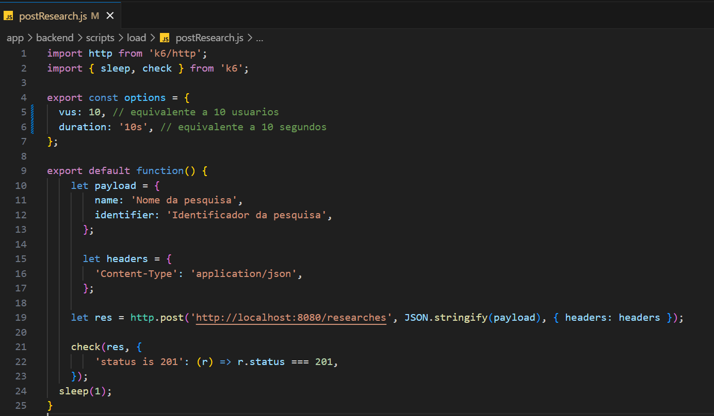
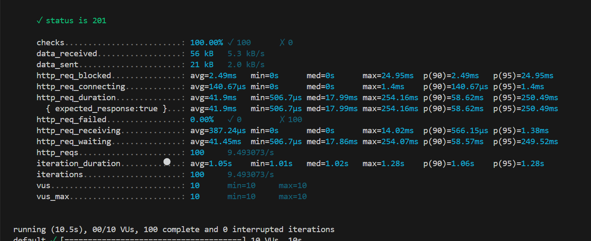

# Avaliando a performance da minha aplicação (Ponderada - S7)

## Endpoint escolhido
O endpoint que escolhi realiza um post de uma pesquisa no sistema. Para rodar ele, basta ir no repositório do meu grupo, navegar até a pasta backend, instalar as dependências com npm i e iniciar a imagem Docker no Docker Desktop.

## Passo a passo

1. `import http from 'k6/http';`: Importa o módulo HTTP do K6 para enviar requisições HTTP. 

2. `import { sleep, check } from 'k6';`: Importa os módulos `sleep` e `check` do K6. O `sleep` é usado para pausar a execução do script por um determinado período de tempo, enquanto o `check` é usado para verificar se uma condição é verdadeira durante o teste.

3. `export const options = { ... }`: Define as opções de teste, como o número de VUs (Virtual Users) e a duração do teste. Neste caso, defini 10 VUs (equivalente a 10 usuários virtuais) que executarão o teste por 10 segundos.

4. `export default function() { ... }`: Define a função de teste que será executada por cada VU.

5. `let payload = { ... }`: Define um objeto payload contendo os dados a serem enviados na requisição. Neste caso, é um objeto JSON com os campos name e identifier (necessários para o envio da pesquisa).

6. `let headers = { ... }`: Define um objeto headers contendo o cabeçalho da requisição. Aqui, é definido que o conteúdo da requisição é do tipo JSON.
Envio da requisição POST:

7. `let res = http.post(...);`: Envia uma requisição POST para o endpoint http://localhost:8080/researches com o payload convertido para JSON e os cabeçalhos definidos anteriormente. O resultado da requisição é armazenado na variável `res`.

8. `check(res, { ... });`: Verifica se a resposta da requisição atende a determinadas condições. Neste caso, verifica se o status da resposta é igual a 201 (Created).

9. `sleep(1);`: Pausa a execução do script por 1 segundo antes de iniciar a próxima iteração. Isso ajuda a simular um comportamento mais realista dos usuários.

## Executar o código

Para rodar o teste, basta navegar até a pasta loads do projeto usando o comando `cd app/backend/scripts/load`, depois disso, rode o comando `k6 run postResearch.js`

## Interpretação dos resultados

`✓ status is 201`: Isso indica que todas as verificações relacionadas ao status da resposta foram bem-sucedidas. Todas as respostas obtidas tiveram o status 201 (Created), conforme esperado.

`checks.........................: 100.00% ✓ 100 ✗ 0`: Todas as verificações foram realizadas com sucesso. Foram feitas 100 verificações, todas passaram e nenhuma falhou.

`data_received..................: 56 kB 5.3 kB/s`: Indica a quantidade de dados recebidos durante o teste e a taxa de recebimento de dados (em kilobytes por segundo).

`data_sent......................: 21 kB 2.0 kB/s`: Mostra a quantidade de dados enviados durante o teste e a taxa de envio de dados (em kilobytes por segundo).

`http_req_blocked...............`: Fornece estatísticas sobre o tempo médio, mínimo, máximo e percentis para o tempo de bloqueio durante as requisições HTTP.

`http_req_connecting............`: Apresenta estatísticas sobre o tempo médio, mínimo, máximo e percentis para o tempo de conexão durante as requisições HTTP.

`http_req_duration..............`: Indica estatísticas sobre a duração média, mínima, máxima e percentis para a duração total das requisições HTTP.

`http_req_failed................`: Mostra a porcentagem de requisições HTTP que falharam durante o teste. Neste caso, todas as requisições foram bem-sucedidas, então a porcentagem de falhas é 0%.

`http_req_receiving.............`: Fornece estatísticas sobre o tempo médio, mínimo, máximo e percentis para o tempo de recebimento durante as requisições HTTP.

`http_req_waiting...............`: Apresenta estatísticas sobre o tempo médio, mínimo, máximo e percentis para o tempo de espera durante as requisições HTTP.

`http_reqs......................`: Indica o número total de requisições HTTP realizadas durante o teste, bem como a taxa de requisições por segundo.

`iteration_duration.............`: Fornece estatísticas sobre a duração média, mínima, máxima e percentis para a duração de cada iteração do teste.

`iterations.....................`: Indica o número total de iterações executadas durante o teste, bem como a taxa de iterações por segundo.

`vus............................`: Indica o número de VUs (usuários virtuais) usados durante o teste, bem como o mínimo e máximo de VUs ativos ao longo do teste.

`vus_max........................`: Indica o número máximo de VUs usados durante o teste.

Em resumo, os resultados mostram que todas as requisições foram bem-sucedidas, o tempo de resposta das requisições foi dentro dos limites esperados e o comportamento do sistema sob carga parece estar satisfatório.